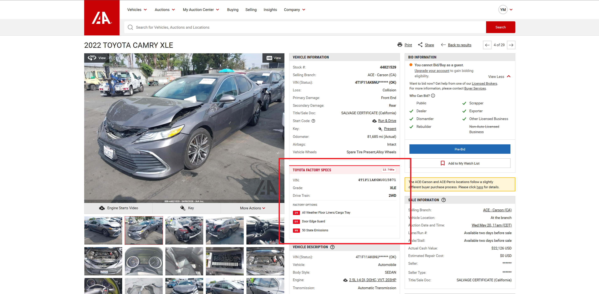

# IAAI Toyota Spec Lookup

[](https://developer.chrome.com/docs/extensions/mv3/intro/)
[](https://developer.mozilla.org/en-US/docs/Web/JavaScript)
[]()
[]()
[]()

> One click → full VIN + Toyota factory spec sheet, right on the IAAI listing page.

IAAI lists Toyota vehicles with a partial VIN. This Chrome extension pulls the full VIN from SCA Auction and the factory equipment list from `toyota.com/owners/vehicle-specification` — and shows everything inline next to IAAI's native info tiles, with a live progress checklist and millisecond timer.



## What it does

1. You land on an IAAI Toyota vehicle detail page.
2. The extension auto-fetches the full VIN from SCA Auction (server-side rendered — no tab needed).
3. It opens `toyota.com/owners/vehicle-specification` briefly, grabs an auth token + a fresh reCAPTCHA token from the page, and calls Toyota's `/v1/vehicle/detailed-specs` API directly.
4. Results render inline as a native-looking IAAI tile (red accent so you know it's ours): Grade, Drive Train, and every factory option as a code-badged row.

Total round-trip: usually under 5 seconds.

## Features

- **Auto-run** on IAAI vehicle detail pages — no clicking
- **Inline tile** styled to match IAAI's native info boxes
- **Live progress checklist** with 6 steps + millisecond elapsed timer
- **VIN appears instantly** the moment SCA returns it (before Toyota even loads)
- **Factory option codes** rendered as small red badges (`2T`, `CY`, `DA`...)
- **Listing-page popups** on search results when you want a quick preview
- **No backend** — everything runs in your browser using your existing sessions

## Requirements

You must be logged in to both sites in the same Chrome profile:

- [`sca.auction`](https://sca.auction) — free account, exposes the full unmasked VIN
- [`toyota.com/owners`](https://www.toyota.com/owners) — free account, gates the spec API

## Install

This isn't on the Chrome Web Store. Load it unpacked:

1. Clone or download this repo
2. Open `chrome://extensions`
3. Toggle **Developer mode** (top right)
4. Click **Load unpacked** and select the `iaai-toyota-lookup` folder

## How it works

| Step | Where | How |
|---|---|---|
| Stock # → full VIN | SCA Auction | `fetch()` from service worker with `credentials: 'include'`. SCA is SSR, so the VIN is in the HTML response. |
| VIN → factory specs | Toyota API | Direct POST to `prod.webservices.toyota.com/v1/vehicle/detailed-specs`. Requires a JWT (read from cookies) + a fresh reCAPTCHA Enterprise token (generated in the Toyota page's main world). |
| Render | IAAI page | Inline tile injected next to `.tile.tile--data`, inheriting IAAI's styles. |

## Files

```
manifest.json        Extension manifest (MV3)
background.js        Service worker — SCA fetch, Toyota tab orchestration, API call
content/iaai.js      Content script — auto-run, inline tile, listing popup
content/iaai.css     Styling for tile, progress checklist, option badges
icons/               16/48/128 px icons
```

## License

MIT
